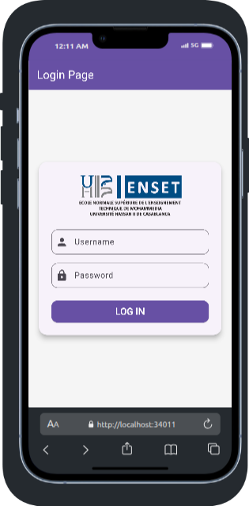

# Flutter Chatbot with LIAMMA

A modern Flutter-based chatbot application that uses the LIAMMA (Ollama) language model for generating responses. This application provides a clean, user-friendly interface for interacting with an AI assistant.

## Screenshots

### Login Screen


*Secure login interface with username and password authentication*

### Chat Interface


*Modern chat interface with real-time streaming responses*

### Saved Conversations


*Access and manage your saved conversations through the drawer menu*

## Features

- Modern and responsive UI design
- Real-time chat interface with streaming responses
- Save and manage multiple conversations
- Secure login system
- Smooth scrolling and message animations
- Support for both desktop and mobile platforms

## Prerequisites

Before running this application, make sure you have the following installed:

1. **Flutter SDK** (latest version)
2. **Dart SDK** (latest version)
3. **Ollama** (for running the LIAMMA model)

## Installation

### 1. Clone the repository
```bash
git clone https://github.com/Abdelouahed06/Enset-chat-bot-using-LIamma.git
cd Enset-chat-bot-using-LIamma
```

### 2. Install Flutter dependencies
```bash
flutter pub get
```

### 3. Install and Set up Ollama

#### For Ubuntu/Debian:
```bash
curl -fsSL https://ollama.com/install.sh | sh
```

#### For macOS:
```bash
brew install ollama
```

#### For Windows:
Download the installer from [Ollama's official website](https://ollama.com)

### 4. Pull the required model
```bash
ollama pull tinydolphin
```

## Running the Application

1. Start the Ollama server:
```bash
ollama serve
```

2. In a new terminal, run the Flutter application:
```bash
flutter run
```

## Usage

### Login
- Username: `admin`
- Password: `1234`

### Chat Interface
- Type your message in the input field at the bottom
- Press the send button or hit enter to send your message
- The AI will respond in real-time with a streaming effect

### Managing Conversations
- Click the menu icon (☰) to open the saved conversations drawer
- Click the "+" icon to start a new conversation
- Previous conversations are saved until you log out
- Click on any saved conversation to load it
- Use the delete icon to remove unwanted conversations

## Building for Production

### Android APK
```bash
flutter build apk --release
```
The APK will be generated at: `build/app/outputs/apk/release/app-release.apk`

### iOS IPA
```bash
flutter build ios --release
```

## Important Notes

1. The application requires Ollama to be running on the same machine or network
2. For mobile deployment, you'll need to:
   - Either run Ollama on a server accessible to the mobile device
   - Or modify the code to use a different LLM API service

## Troubleshooting

1. If the chat doesn't respond:
   - Ensure Ollama server is running
   - Check if the model is properly installed
   - Verify your network connection

2. If the app fails to build:
   - Run `flutter clean`
   - Run `flutter pub get`
   - Try building again
